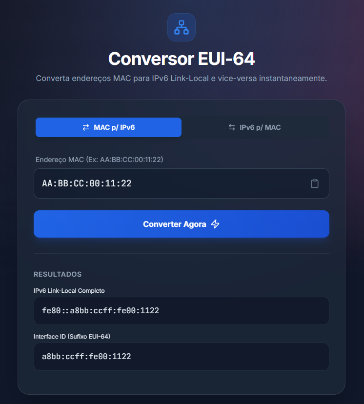

# ⚡ Conversor EUI-64 (MAC ↔ IPv6)

Uma ferramenta moderna, elegante e responsiva para engenheiros de rede e desenvolvedores.

  <a href="#-funcionalidades">Funcionalidades</a> •
  <a href="#-tecnologias">Tecnologias</a> •
  <a href="#-como-usar">Como Usar</a> •
  <a href="#-lógica-eui-64">Lógica EUI-64</a>

---

## 📖 Sobre o Projeto

Este projeto é uma aplicação web *Single Page Application* (SPA), leve e autônoma, projetada para converter endereços físicos (MAC) em endereços IPv6 Link-Local utilizando o padrão **EUI-64**, além de realizar o caminho inverso.

O foco principal é oferecer uma UI/UX moderna, utilizando conceitos como **Glassmorphism**, gradientes suaves e feedback visual intuitivo — fugindo do visual tradicional das ferramentas de rede.

---

## ✨ Funcionalidades

### 🔄 Conversão Bidirecional
- **MAC → IPv6:** Gera o endereço Link-Local (`fe80::`) e o *Interface ID* usando EUI-64.
- **IPv6 → MAC:** Recupera o endereço MAC original a partir de um IPv6 EUI-64 válido.

### 🎨 UI Moderna (Glassmorphism)
Design sofisticado e translúcido com animações sutis.

### 📱 Totalmente Responsivo
Funciona perfeitamente em **desktop**, **tablet** e **mobile**.

### 📋 Copiar e Colar Inteligente
Botões dedicados com feedback visual (*toasts*).

### 🛡️ Validação em Tempo Real
Detecta formatos inválidos e orienta o usuário imediatamente.

### 🚀 Zero Dependências de Build
Feito com **HTML5 puro** e **Tailwind via CDN**. Basta abrir o arquivo e usar.

---

## 🛠 Tecnologias

- **HTML5 Semântico** – Estrutura  
- **Tailwind CSS (CDN)** – Estilização e layout  
- **JavaScript Vanilla** – Conversão e manipulação de bits  
- **Lucide Icons** – Ícones modernos  
- **Fontes:** Inter & JetBrains Mono (Google Fonts)

---

## 🚀 Como Usar

### 1️⃣ Clone o repositório  
git clone https://github.com/lyma/eui64-converter.git

### 2️⃣ Execute  
Abra o arquivo:

index.html

O navegador abrirá a ferramenta instantaneamente.

---

## 🧠 Lógica EUI-64

### 🔹 MAC ➡️ IPv6
1. Divide o MAC em dois blocos de 24 bits (OUI e NIC).  
2. Insere `FFFE` no meio.  
3. Inverte o 7º bit do primeiro byte (bit U/L).  
4. Adiciona o prefixo `fe80::`.

### 🔹 IPv6 ➡️ MAC
1. Verifica se o sufixo contém `fffe`.  
2. Remove `fffe` para reconstruir o MAC.  
3. Inverte novamente o 7º bit para restaurar o MAC original.

---

## 🤝 Contribuição

1. Faça um fork  
2. Crie uma branch:  
git checkout -b feature/NovaFeature  
3. Commit:  
git commit -m "Add: Nova Feature"  
4. Push:  
git push origin feature/NovaFeature  
5. Abra um Pull Request

---

## 📄 Licença

MIT — Sinta-se livre para usar, estudar e modificar.

---

Feito com 💙 e ☕ por <a href="https://github.com/lyma">lyma</a>

